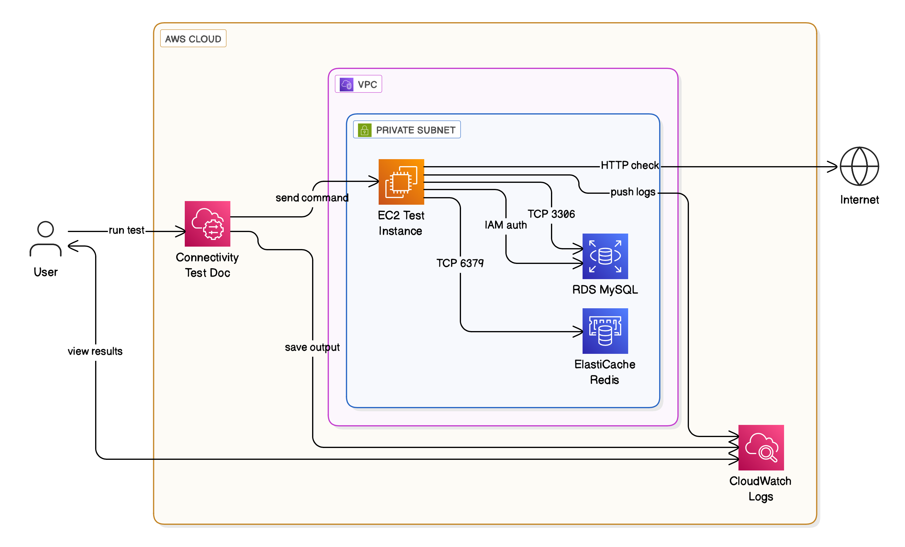

# Cloud Connectivity Check (Terraform + AWS)

This repository provides a Terraform-based solution for verifying network and service connectivity between cloud components in AWS. It includes modular Terraform code and helper scripts to provision infrastructure, perform connectivity diagnostics, and collect test logs—fully automated using AWS Systems Manager (SSM) documents.

---

## Purpose

The **Cloud Connectivity Check** helps validate the following:

-  EC2 instance reachability to **RDS (MySQL)** on port `3306`
-  EC2 connectivity to **Redis** on port `6379`
-  Proper functioning of **IAM-based RDS authentication**
-  EC2 instance **internet access**
-  Collection of test results via **SSM and CloudWatch Logs**

---

---

## Launch Template Configuration

The EC2 instances are deployed using a **Launch Template**. You can customize the following parameters for your environment:

- **architecture**: CPU architecture type  
  Options:  
  - `"x86_64"` (Intel/AMD)  
  - `"arm64"` (AWS Graviton - ARM-based)

- **storage**: EBS volume type  
  Options:  
  - `"gp2"`: General Purpose SSD (default)  
  - `"gp3"`: Next-generation SSD (better baseline performance and tunable IOPS/throughput)  
  - `"io1"` / `"io2"`: Provisioned IOPS SSD (for high-performance workloads)  
  - `"sc1"` / `"st1"`: Throughput-optimized HDD (ideal for large-scale data processing)

- **instance_type**: EC2 instance type  
  Examples:  
  - `"t2.micro"`: Free tier eligible  
  - `"t3.micro"` / `"t3a.micro"`: Burstable general purpose  
  - `"t4g.micro"`: ARM-based, cost-efficient (Graviton)

---

##  Repository Structure

```
cloud-connectivity-check/
├── modules/
│   ├── cloudwatch/           # CloudWatch logs configuration
│   ├── connectivity/         # Connectivity test orchestration
│   ├── environment/          # EC2, RDS, Redis, IAM setup
│   └── network/              # VPC, subnets, security groups
├── outputs/                  # SSM/CloudWatch test result logs
│   └── connectivity_test_staging.txt
├── policies/                 # IAM policies for EC2 and SSM
├── scripts/                  # Shell scripts for testing & automation
│   ├── connectivity-test.sh
│   ├── fetch_ssm_test_logs.sh
│   ├── generate_provider_file.sh
│   └── user_data.sh.tmpl
├── main.tf                   # Terraform root configuration
├── variables.tf              # Input variables
├── outputs.tf                # Outputs
├── locals.tf                 # Local variables
├── providers.tf              # Provider configuration
├── terraform.auto.tfvars     # Environment-specific variables
├── Makefile                  # Automation commands
└── README.md                 # Project documentation
```

---

##  How It Works

1. **Provision Infrastructure**
   - Deploys a test environment with VPC, EC2, RDS, Redis, IAM roles, and CloudWatch setup.

2. **Run Connectivity Tests**
   - The EC2 instance runs `connectivity-test.sh` via `user_data` or SSM, verifying:
     - Port access to RDS & Redis
     - IAM authentication to RDS
     - Internet access

3. **Log Collection**
   - Logs are forwarded to **CloudWatch**
   - Can be retrieved via `scripts/fetch_ssm_test_logs.sh` or from the `outputs/` folder

---

## Sample Output

```bash
-------------------2025-06-26 02:38:59-----------------------
== START CONNECTIVITY TEST ==

SSM Shell Environment Diagnostics:
User: root
Home:

MySQL Defaults:
mysql would have been started with the following arguments:

Testing RDS Port...
✅ RDS port 3306 is reachable

Testing Redis Port...
✅ Redis port 6379 is reachable

Ensuring IAM Auth Plugin is configured...
mysql: [Warning] Using a password on the command line interface can be insecure.

Generating RDS IAM Auth Token...
Testing IAM Authentication...
✅ IAM RDS auth succeeded

Testing internet access...
✅ EC2 instance has internet access

== END CONNECTIVITY TEST ==
```

---


## Usage

### 1. Apply Infrastructure & Run Connectivity Test

```bash
make apply-and-test
```

This command will:

* Initialize and apply the Terraform configuration
* Wait for test logs to be published
* Automatically fetch logs from CloudWatch for the test EC2 instance
* Save them to `outputs/connectivity_test_staging.txt`

---

### 2. Destroy the Environment

```bash
make delete
```

This will:

* Tear down all provisioned resources using `terraform destroy -auto-approve`
* Confirm when the environment has been fully deleted

---

## License

This project is licensed under the [MIT License](LICENSE).

---

##  Maintainer

**Fekri Saleh**  
Cloud Architect & DevOps Engineer  
